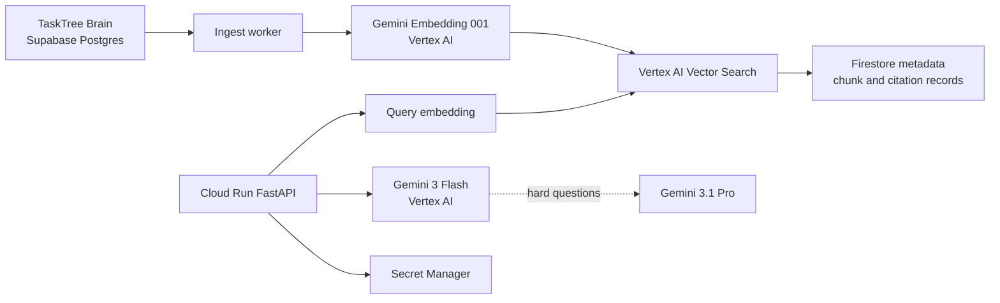

# Brain RAG Gemini

Production-shaped, grounded RAG over the Brain memory used by TaskTree.
The RAG runtime is Google Cloud-native: Gemini embeddings and generation run on
Vertex AI, production vectors run on Vertex AI Vector Search, metadata runs in
Firestore, secrets run in Secret Manager, and the API deploys to Cloud Run.

TaskTree's source of truth is split by design: operational application data is
in Firestore, while Brain's entities, observations, and relations are in the
existing Supabase Postgres memory service. This repository reads Brain through
a read-only adapter and does not copy or mutate the source database.

## Architecture



For local development, the same ports are backed by deterministic hash
embeddings and SQLite. This makes tests and `docker compose up` independent of
credentials while keeping the production adapters explicit.

## Current Google model IDs

The defaults are checked against the current Google Cloud documentation:

- `gemini-embedding-001`, configured to emit 768 dimensions for the index.
- `gemini-3-flash-preview` for normal answers and structured JSON.
- `gemini-3.1-pro-preview` as the current Gemini 3 Pro successor for difficult questions.
- `gemini-3.1-flash-lite` for the evaluation judge.

Gemini 3 Flash and Gemini 3.1 Pro support structured output and explicit context
caching. The model IDs are environment variables so a preview-to-stable model
transition does not require a code change.

## Local run

Requires Docker, or Python 3.12 with `uv`.

```powershell
Copy-Item .env.example .env
docker compose up --build
```

Then:

```powershell
Invoke-RestMethod http://localhost:8080/health
Invoke-RestMethod -Method Post http://localhost:8080/v1/ingest
Invoke-RestMethod -Method Post -ContentType 'application/json' `
  -Body '{"question":"Gdzie Brain przechowuje obserwacje?","top_k":3}' `
  http://localhost:8080/v1/query
```

Without GCP or Supabase variables the API uses a tiny local fixture and local
SQLite, which is intended only for smoke testing. With `GOOGLE_CLOUD_PROJECT`
and Application Default Credentials, it uses Vertex AI. With
`TASKTREE_DATABASE_URL`, ingestion reads the TaskTree Brain workspace selected
by `BRAIN_WORKSPACE_ID`.

## Tests and quality

```powershell
uv sync --python 3.12
uv run pytest
uv run ruff check src tests scripts
uv run mypy src
```

Tests use fake embedding and generation ports. They cover chunking, alias
filtering, hybrid retrieval, entity/section filters, SQLite persistence,
grounding validation, routing, cost limits, ingestion batching, API behavior,
and evaluation metrics.

## Production setup

1. Set `GOOGLE_CLOUD_PROJECT`, `GOOGLE_CLOUD_LOCATION=global`, and
   `GOOGLE_GENAI_USE_VERTEXAI=True`.
2. Set `TASKTREE_DATABASE_URL` outside the repository and grant the read-only
   role only the Brain tables needed by the adapter.
3. Create a Vertex AI Vector Search index with 768 dimensions and deploy it to
   an endpoint. Set the three `VERTEX_*` variables.
4. Create the Cloud Run service account and Secret Manager secret with
   `scripts/deploy.ps1`.
5. Run the one-time ingestion job and verify `/v1/query` with a real Vertex
   request. The service logs model, latency, token counts, and estimated cost
   for each embedding/generation call.

The local SQLite adapter is intentionally retained for tests and development;
production uses the `VertexVectorSearchStore` adapter. Vertex Vector Search
requires a provisioned index and endpoint, so it is preferable here to RAG
Engine: the application needs explicit fact IDs and metadata filters for a
citation guardrail, while Vector Search exposes those IDs and namespaces
directly.

## Evaluation

`eval/golden.json` contains ten small gold questions. `scripts/evaluate.py` is a
starter runner for the local fixture; the production evaluation should run the
retriever and ask `gemini-3.1-flash-lite` to judge faithfulness. The metric
helpers are in `brain_rag.eval` and report recall@k and citation faithfulness.

## Security

No service-account JSON, API key, Supabase password, or access token belongs in
this repository. Cloud Run receives secrets from Secret Manager. The answer
guardrail rejects any citation ID that was not returned by retrieval, and query
cost and output token limits are enforced before returning a result.

